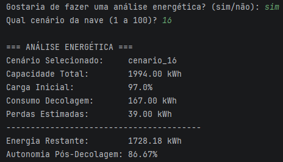

# Sobre o projeto

O projeto simula a leitura de dados de sensores de uma nave espacial e, a partir de parametros predefinidas, decide automaticamente entre:

-  **PRONTO PARA DECOLAR**
-  **DECOLAGEM ABORTADA**

Além da lógica de decisão, o projeto inclui uma análise da autonomia energética da nave e uma etapa de análise assistida por IA para classificação de dados e identificação de anomalias.

##  Estrutura do projeto

### 1.1 Organização e descrição da telemetria
Interpretação dos dados recebidos dos sensores da nave:
- Temperatura interna e externa
- Integridade estrutural (0/1)
- Níveis de energia (%)
- Pressão dos tanques
- Status dos módulos críticos

### 1.2 Algoritmo de verificação
Fluxograma/pseudocódigo que define a lógica de decisão entre **PRONTO PARA DECOLAR** e **DECOLAGEM ABORTADA**, com base em faixas seguras predefinidas para cada variável de telemetria.

veja em [algoritimo.md](algoritimo.md)
veja em [pseudocodigo.md](pseudo_codigo.md)

### 1.3 Script em Python
Implementação da lógica do algoritmo em Python, simulando:
- Leitura dos dados de telemetria
- Execução das verificações de segurança
- Impressão do resultado final

a implementacao do algoritimo foi feito pelo script verificacao.py tambem foi criado um banco de dados com dados aleatorios para medir os paramentros de varios cenarios, e assim ter uma metrica mais variada o banco de dados foi processado pelo script processar_csv.py do mesmo jeito foi feita pela analise energetica 

 Estrutura do Projeto
```
scripts/
├── .venv/                      # Ambiente virtual Python
├── analise_energetica.py       # Script de análise energética
├── banco_de_dados_real.csv     # Base de dados utilizada
├── main.py                     # Ponto de entrada principal do projeto
├── notebook.ipynb              # arquivo notebook.ipynb
├── processar_csv.py            # Script de processamento/tratamento do CSV
└── verificacao.py              # Script de verificação/validação dos dados
```             

### 1.4 Análise energética
Cálculo da autonomia inicial da nave, considerando:
- Capacidade total (kWh)
- Carga atual (%)
- Consumo estimado na decolagem
- Perdas energéticas

### 1.5 Análise assistida por IA
Uso de IA para apoiar a tomada de decisão, incluindo:
- Classificação dos dados de telemetria
- Identificação de possíveis anomalias
- Sugestões de nível de risco

veja em [analise_IA](analise_IA/analise.md)

## Tecnologias utilizadas

- **Python** — implementação do algoritmo de verificação e simulação
- **IA** — apoio à análise de dados e identificação de riscos

## Como executar o projeto

### 1. Instale o Python

Baixe e instale o Python pelo site oficial:
https://www.python.org/downloads/

No Windows, marque a opção **Add Python to PATH** durante a instalação.

### 2. Baixe o projeto

Clique em **Code → Download ZIP** no GitHub e extraia os arquivos.

Ou clone o repositório:

```bash
git clone https://github.com/pietromaimone/PROJETO-PRE-DECOLAGEM-FIAP-.git
```

### 3. Instale as dependências

Abra o terminal na pasta do projeto e execute:

```bash
pip install -r requirements.txt
```

### 4. Execute o programa

Execute o arquivo principal:

```bash
python nome_do_arquivo.py
```

Substitua `nome_do_arquivo.py` pelo nome do arquivo principal do projeto.


# PRINTS DE EXECUCAO


------------------------------------------------------------

