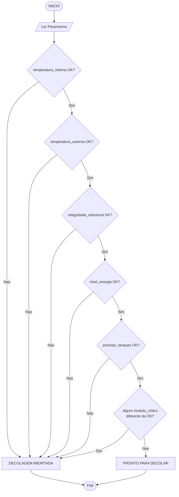

```mermaid
flowchart TD
    A([INICIO]) --> B[/"Ler Parametros"/]

    B --> C{"temperatura_interna OK?"}
    C -- Nao --> Z["DECOLAGEM ABORTADA"]
    C -- Sim --> D{"temperatura_externa OK?"}

    D -- Nao --> Z
    D -- Sim --> E{"integridade_estrutural OK?"}

    E -- Nao --> Z
    E -- Sim --> F{"nivel_energia OK?"}

    F -- Nao --> Z
    F -- Sim --> G{"pressao_tanques OK?"}

    G -- Nao --> Z
    G -- Sim --> H{"algum modulo_critico
diferente de OK?"}

    H -- Sim --> Z
    H -- Nao --> Y["PRONTO PARA DECOLAR"]

    Z --> FIM([FIM])
    Y --> FIM
```
